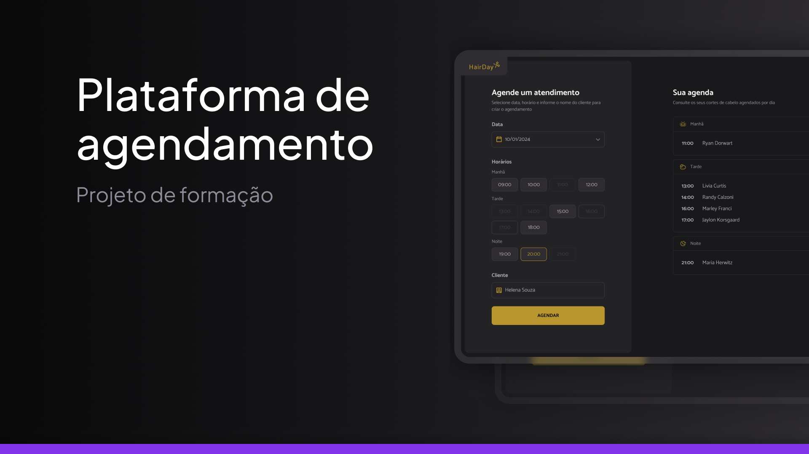

<h1 align="center">Hairday</h1>

Uma aplicação de agendamento de cortes para um cabeleireiro feito como forma de estudos do curso Fullstack da Rocketseat

<a href="">🔗 Live Preview</a>&nbsp;&nbsp;&nbsp;|&nbsp;&nbsp;&nbsp;
<a href="#-tecnologias">🚀 Tecnologias</a>&nbsp;&nbsp;&nbsp; |&nbsp;&nbsp;&nbsp;&nbsp;
<a href="#-desafio">💻 Desafio</a>&nbsp;&nbsp;&nbsp;|&nbsp;&nbsp;&nbsp;
<a href="#-aprendizados">📚 Aprendizados</a>

## 🚀 Tecnologias

Esse projeto foi desenvolvido com as seguintes tecnologias:

- JavaScript
- HTML e CSS
- Git e Github
- FIGMA

## 💻 Desafio

O "Hairday" foi um projeto do curso Fullstack da Rocketseat no módulo "JavaScript". Nele, consolidei conhecimentos sobre compiladores, bundlers, criação e consumo de uma API e funções assíncronas, criando uma aplicação dinâmica e interativa.

## 📚 Aprendizados

Este projeto foi feito como forma de estudos dentro do curso de Fullstack no módulo "JavaScript" da Rocketseat.
Nele pude consolidar os conhecimentos sobre:

### JavaScript
- Compiladores
- Bundlers
- API
- Funções assíncronas
